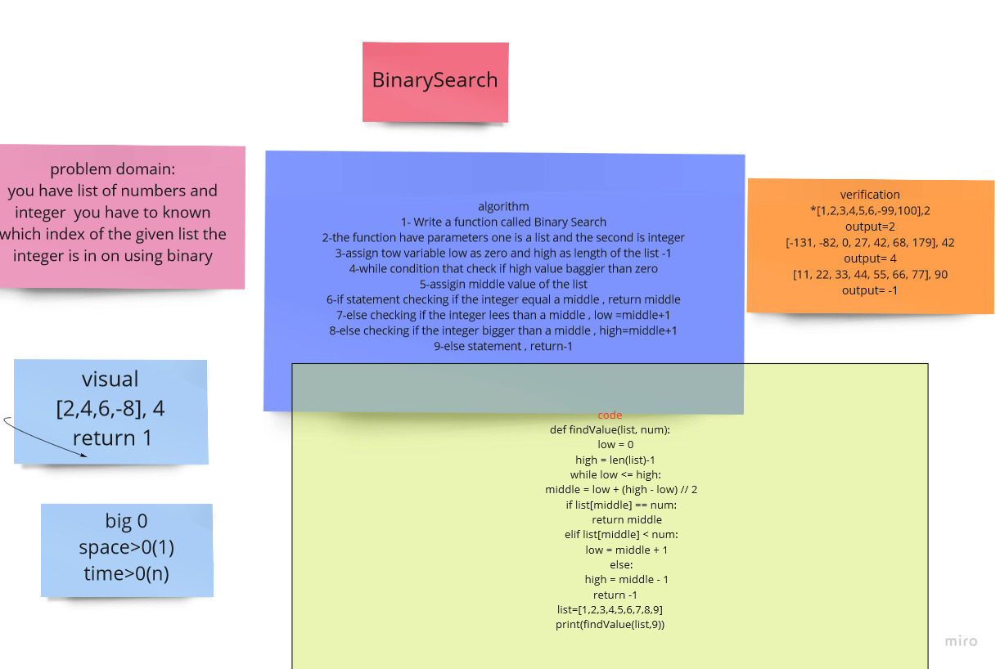

# Insert to Middle of an Array
<!-- Description of the challenge -->
Write a function called insertShiftArray which takes in an array and a value to be added. Without utilizing any of the built-in methods available to your language, return an array with the new value added at the middle index.
## Whiteboard Process
<!-- Embedded whiteboard image -->
+ 
## Approach & Efficiency
<!-- What approach did you take? Discuss Why. What is the Big O space/time for this approach? -->
+ O(logn),o(1)m

# Reverse an Array
<!-- Description of the challenge -->
Write a function called BinarySearch which takes in 2 parameters: a sorted array and the search key. Without utilizing any of the built-in methods available to your language, return the index of the array’s element that is equal to the value of the search key, or -1 if the element is not in the array.

NOTE: The search algorithm used in your function should be a binary search.

## Whiteboard Process
<!-- Embedded whiteboard image -->

## Approach & Efficiency
<!-- What approach did you take? Discuss Why. What is the Big O space/time for this approach? -->
- space>0(1)

