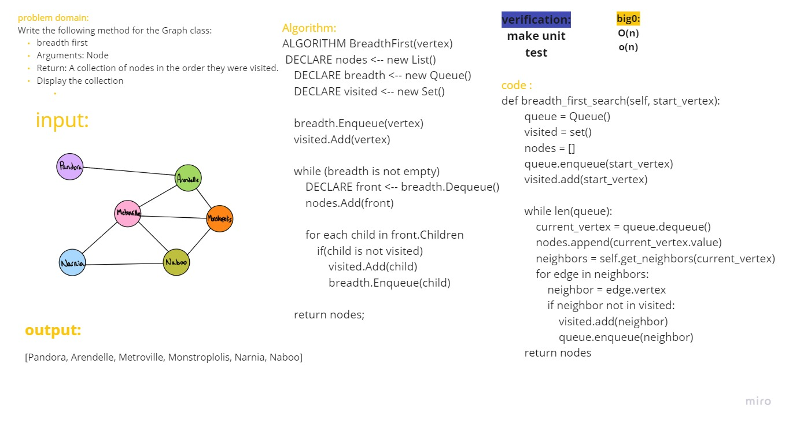
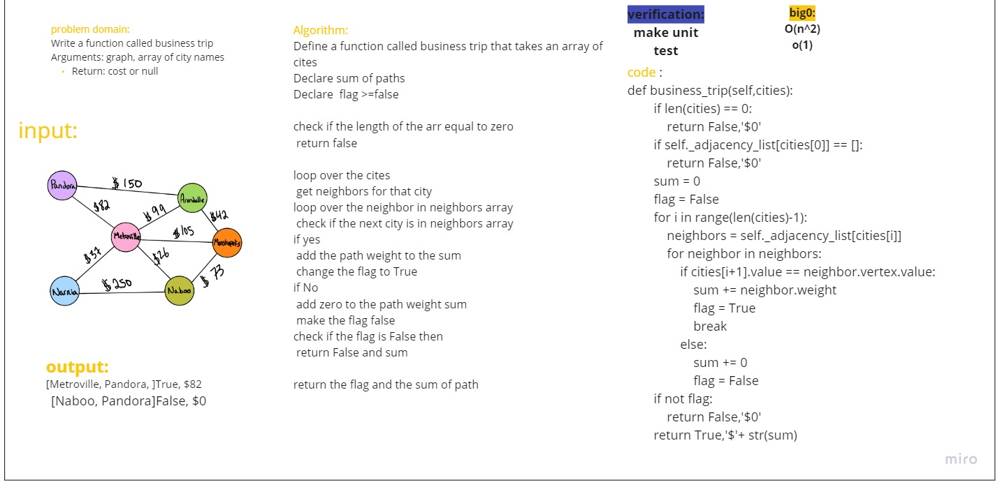
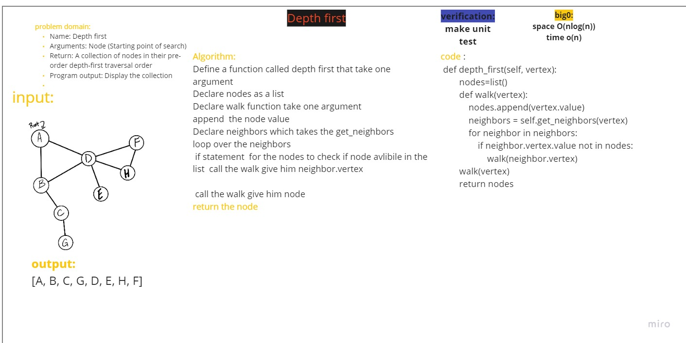

## *Code Challenge Class 35*
# Graphs
A graph is a non-linear data structure that can be looked at as a collection of vertices (or nodes) potentially connected by line segments named edges.
## Challenge
<!-- Description of the challenge -->
building a graph class that includes the following methods:

    add_node
    add_edge
    get_nodes
    get_edges
    get_neighbors

## API
<!-- Description of each method publicly available in your Graph -->
+ add node
    +    Arguments: value
    +    Returns: The added node
    +    Add a node to the graph
+ add edge
    + Arguments: 2 nodes to be connected by the edge,  weight (optional)
    + Returns: nothing
    + Adds a new edge between two nodes in the graph
    + If specified, assign a weight to the edge
    + Both nodes should already be in the Graph
+ get nodes
    + Arguments: none
    + Returns all of the nodes in the graph as a collection (set, list, or similar)
+ get neighbors
    + Arguments: node
    + Returns a collection of edges connected to the given node
    + Include the weight of the connection in the returned collection
+ size
    + Arguments: none
    + Returns the total number of nodes in the graph
## Check list

- [x] Node can be successfully added to the graph
- [x] An empty graph properly returns zero
- [x] The proper size is returned, representing the number of nodes in the graph
- [x] An edge can be successfully added to the graph
- [x] A collection of all nodes can be properly retrieved from the graph
- [x] Neighbors are returned with the weight between nodes included
- [x] All appropriate neighbors can be retrieved from the graph
## Pull Request
[PR](https://github.com/mohammadsilwadi/data-structures-and-algorithms/pull/43)
## *Code Challenge Class 36*

## Challenge
<!-- Description of the challenge -->
Breadth First Search (BFS) algorithm traverses a graph in a breadthward motion and uses a queue to remember to get the next vertex to start a search

## API
 breadth first
    Arguments: Node
    Return: A collection of nodes in the order they were visited.
    Display the collection

## Wihtebored

## Pull Request
[PR](https://github.com/mohammadsilwadi/data-structures-and-algorithms/pull/45)

## *Code Challenge Class 37*

## Challenge
<!-- Description of the challenge -->
Write a function called business trip
Arguments: graph, array of city names
Return: cost or null

## Wihtebored

## Pull Request
[PR](https://github.com/mohammadsilwadi/data-structures-and-algorithms/pull/46)
## *Code Challenge Class 38*

## Challenge
<!-- Description of the challenge -->
Name: Depth first
Arguments: Node (Starting point of search)
Return: A collection of nodes in their pre-order depth-first traversal order
Program output: Display the collection

## Wihtebored

## Pull Request
[PR](https://github.com/mohammadsilwadi/data-structures-and-algorithms/pull/47)
