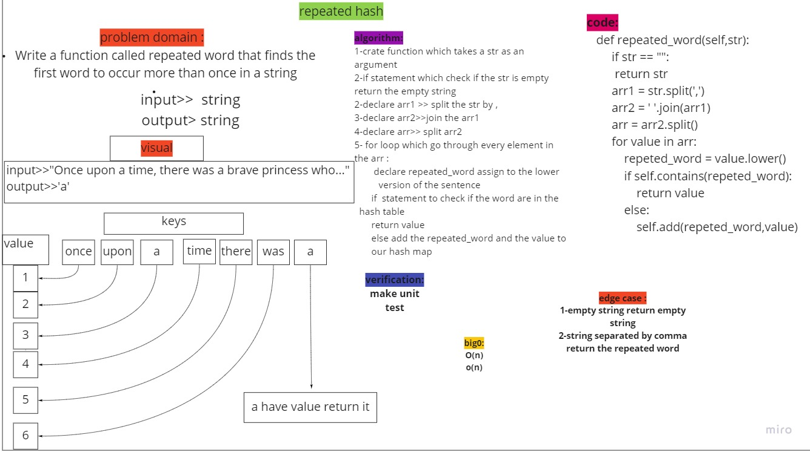

# Repeated hash map
<!-- Short summary or background information -->

## Challenge
<!-- Description of the challenge -->
Write a function called repeated word that finds the first word to occur more than once in a string
Arguments: string
Return: string

## Approach & Efficiency
<!-- What approach did you take? Why? What is the Big O space/time for this approach? -->
Big O for time is O(n).

Big O for space complexity of O(n)

## whiteboard

## pull request
[PR](https://github.com/mohammadsilwadi/data-structures-and-algorithms/pull/40)
