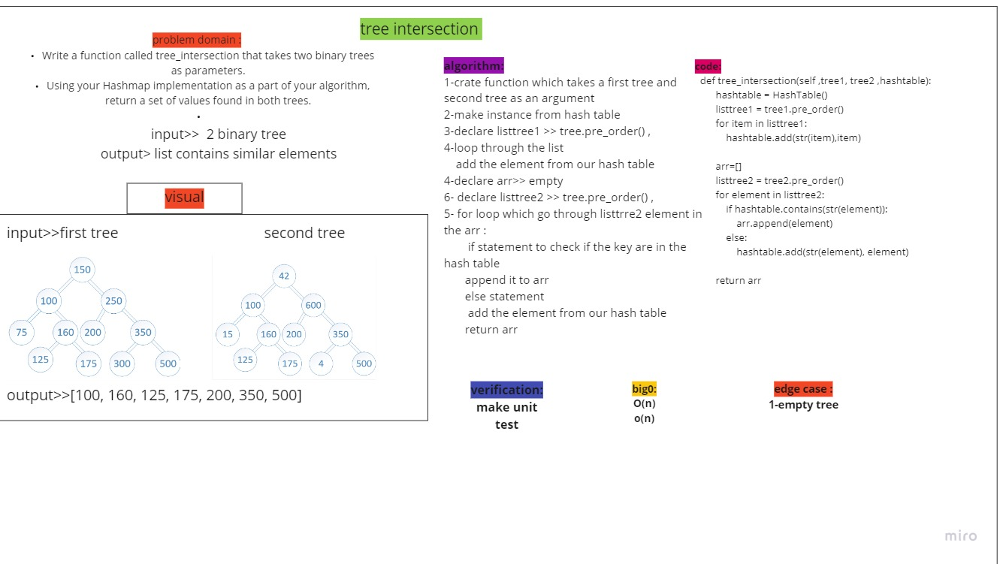

# Tree intersection
<!-- Short summary or background information -->

## Challenge
<!-- Description of the challenge -->

 Write a function called tree_intersection that takes two binary trees as parameters.
 Using your Hashmap implementation as a part of your algorithm, return a set of values found in both trees.

## Approach & Efficiency
<!-- What approach did you take? Why? What is the Big O space/time for this approach? -->
Big O for time is O(n).

Big O for space complexity of O(n)

## whiteboard

## pull request
[PR](https://github.com/mohammadsilwadi/data-structures-and-algorithms/pull/41)
