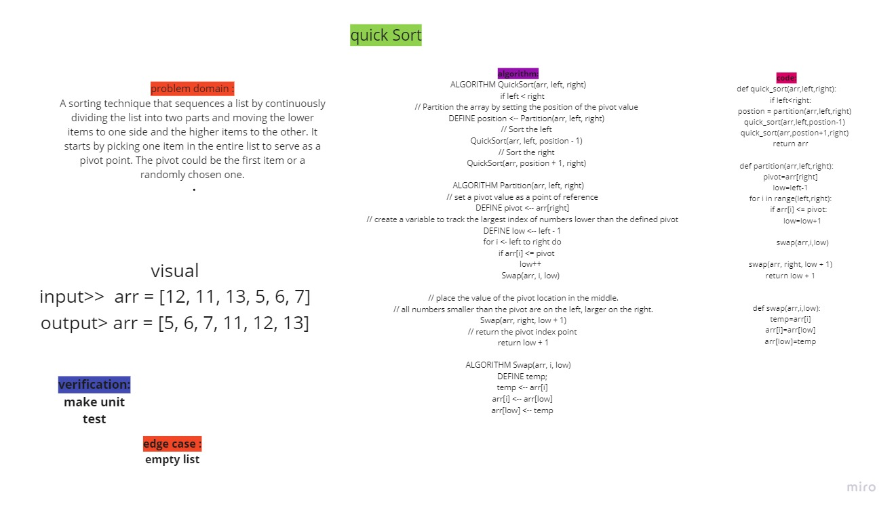

# Merge sort
## Challenge Summary
A sorting technique that sequences a list by continuously dividing the list into two parts and moving the lower items to one side and the higher items to the other. It starts by picking one item in the entire list to serve as a pivot point. The pivot could be the first item or a randomly chosen one.

## Whiteboard Process
<!-- Embedded whiteboard image -->
+ [ Whiteboard   ]()

## Approach & Efficiency
<!-- What approach did you take? Why? What is the Big O space/time for this approach? -->
Time: O(n^2)
The basic operation of this algorithm is comparison. This will happen n * (n-1) number of times…concluding the algorithm to be n squared.
Space: O(1)
No additional space is being created. This array is being sorted in place…keeping the space at constant O(1).
## Solution
<!-- Show how to run your code, and examples of it in action -->
[Pull Request](https://github.com/mohammadsilwadi/data-structures-and-algorithms/pull/38)
