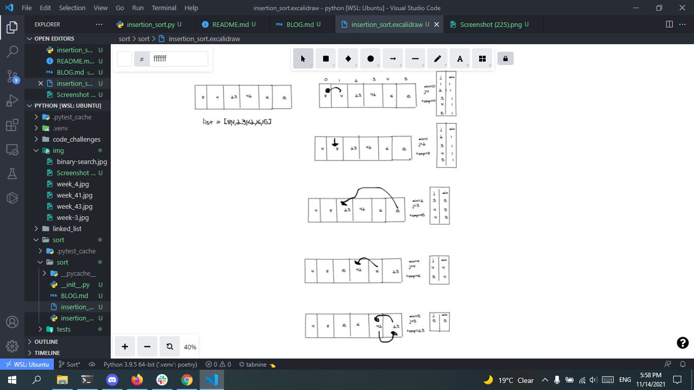

# Insertion Sort
## Challenge Summary
Selection Sort is a sorting algorithm that traverses the array multiple times as it slowly builds out the sorting sequence. The traversal keeps track of the minimum value and places it in the front of the array which should be incrementally sorted

## Whiteboard Process
<!-- Embedded whiteboard image -->
+ [ Whiteboard   ]()

## Approach & Efficiency
<!-- What approach did you take? Why? What is the Big O space/time for this approach? -->
-  O(1)
-  O(n)
## Solution
<!-- Show how to run your code, and examples of it in action -->
[Pull Request](https://github.com/mohammadsilwadi/data-structures-and-algorithms/pull/36)
