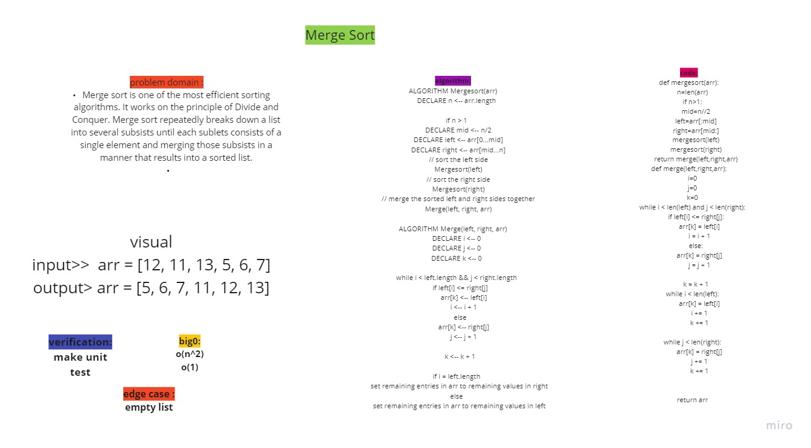

# Merge sort
## Challenge Summary
Merge sort is one of the most efficient sorting algorithms. It works on the principle of Divide and Conquer. Merge sort repeatedly breaks down a list into several sublists until each sublist consists of a single element and merging those sublists in a manner that results into a sorted list.

## Whiteboard Process
<!-- Embedded whiteboard image -->
+ [ Whiteboard   ]()

## Approach & Efficiency
<!-- What approach did you take? Why? What is the Big O space/time for this approach? -->
Time: O(n^2)
The basic operation of this algorithm is comparison. This will happen n * (n-1) number of times…concluding the algorithm to be n squared.
Space: O(1)
No additional space is being created. This array is being sorted in place…keeping the space at constant O(1).
## Solution
<!-- Show how to run your code, and examples of it in action -->
[Pull Request](https://github.com/mohammadsilwadi/data-structures-and-algorithms/pull/37)
