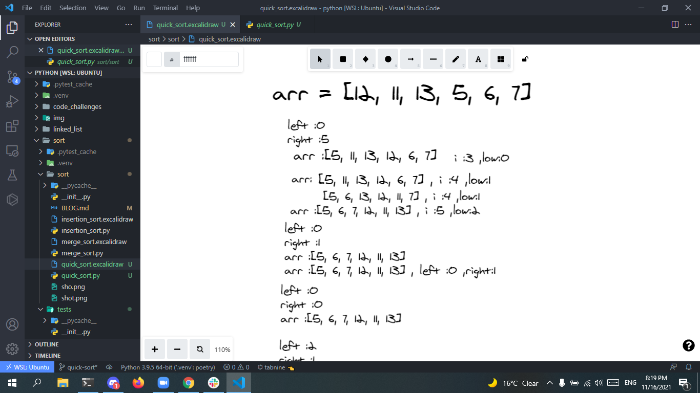
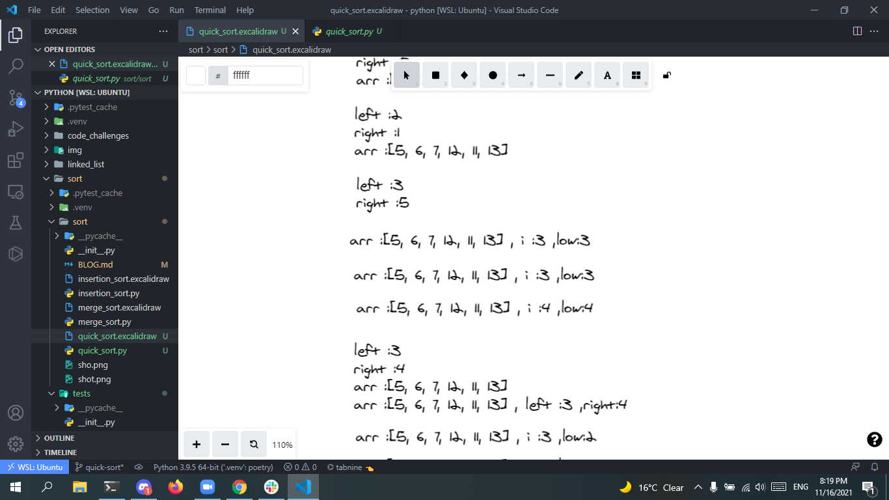
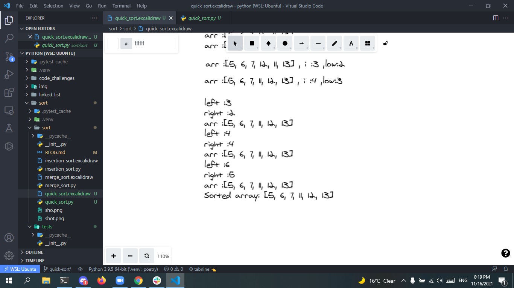

#  Quick sort

## Quick sortt pseudo code

+ pseudo code for Quick sort:
```
ALGORITHM QuickSort(arr, left, right)
    if left < right
        // Partition the array by setting the position of the pivot value
        DEFINE position <-- Partition(arr, left, right)
        // Sort the left
        QuickSort(arr, left, position - 1)
        // Sort the right
        QuickSort(arr, position + 1, right)

ALGORITHM Partition(arr, left, right)
    // set a pivot value as a point of reference
    DEFINE pivot <-- arr[right]
    // create a variable to track the largest index of numbers lower than the defined pivot
    DEFINE low <-- left - 1
    for i <- left to right do
        if arr[i] <= pivot
            low++
            Swap(arr, i, low)

     // place the value of the pivot location in the middle.
     // all numbers smaller than the pivot are on the left, larger on the right.
     Swap(arr, right, low + 1)
    // return the pivot index point
     return low + 1

ALGORITHM Swap(arr, i, low)
    DEFINE temp;
    temp <-- arr[i]
    arr[i] <-- arr[low]
    arr[low] <-- temp
```
+ python code for Quick sort:

```
def quick_sort(arr,left,right):
    if left<right:
        postion = partition(arr,left,right)
        quick_sort(arr,left,postion-1)
        quick_sort(arr,postion+1,right)
    return arr

def partition(arr,left,right):
    pivot=arr[right]
    low=left-1
    for i in range(left,right):
            if arr[i] <= pivot:
                low=low+1

                swap(arr,i,low)

    swap(arr, right, low + 1)
    return low + 1


def swap(arr,i,low):
    temp=arr[i]
    arr[i]=arr[low]
    arr[low]=temp

```
### visual step







### Efficency
Time: O(log(n))
The basic operation of this algorithm is comparison. This will happen n * (n-1) number of times…concluding the algorithm to be n squared.
Space: O(1)
No additional space is being created. This array is being sorted in place…keeping the space at constant O(1).

[Pull Request](https://github.com/mohammadsilwadi/data-structures-and-algorithms/pull/38)


