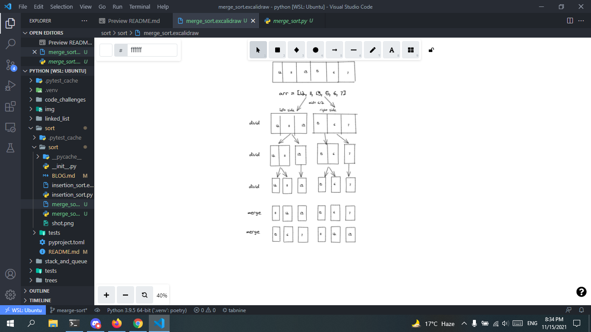

# Merge Sort

## Insertion Sort pseudo code

+ pseudo code for insertion sort:
```
ALGORITHM Mergesort(arr)
    DECLARE n <-- arr.length

    if n > 1
      DECLARE mid <-- n/2
      DECLARE left <-- arr[0...mid]
      DECLARE right <-- arr[mid...n]
      // sort the left side
      Mergesort(left)
      // sort the right side
      Mergesort(right)
      // merge the sorted left and right sides together
      Merge(left, right, arr)

ALGORITHM Merge(left, right, arr)
    DECLARE i <-- 0
    DECLARE j <-- 0
    DECLARE k <-- 0

    while i < left.length && j < right.length
        if left[i] <= right[j]
            arr[k] <-- left[i]
            i <-- i + 1
        else
            arr[k] <-- right[j]
            j <-- j + 1

        k <-- k + 1

    if i = left.length
       set remaining entries in arr to remaining values in right
    else
       set remaining entries in arr to remaining values in left
```
+ python code for insertion sort:

```
def mergesort(arr):
    n=len(arr)
    if n>1:
        mid=n//2
        left=arr[:mid]
        right=arr[mid:]
        mergesort(left)
        mergesort(right)
        return merge(left,right,arr)
def merge(left,right,arr):
    i=0
    j=0
    k=0
    while i < len(left) and j < len(right):
        if left[i] <= right[j]:
            arr[k] = left[i]
            i = i + 1
        else:
            arr[k] = right[j]
            j = j + 1

        k = k + 1
    while i < len(left):
            arr[k] = left[i]
            i += 1
            k += 1

    while j < len(right):
            arr[k] = right[j]
            j += 1
            k += 1


    return arr


```
### visual step




### Efficency
Time: O(n^2)
The basic operation of this algorithm is comparison. This will happen n * (n-1) number of times…concluding the algorithm to be n squared.
Space: O(1)
No additional space is being created. This array is being sorted in place…keeping the space at constant O(1).

[Pull Request](https://github.com/mohammadsilwadi/data-structures-and-algorithms/pull/37)


