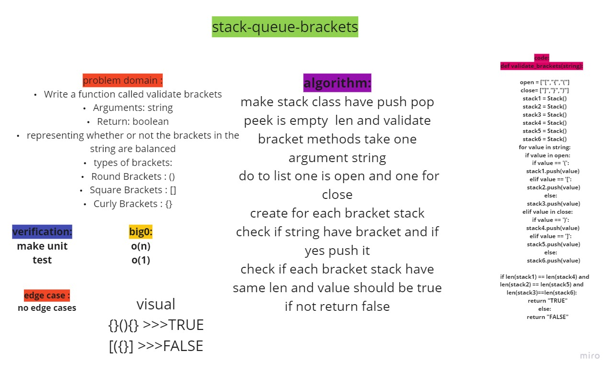

# stack-queue-bracket
## Challenge Summary
    Write a function called validate brackets
    Arguments: string
    Return: boolean
        representing whether or not the brackets in the string are balanced
There are 3 types of brackets:
    Round Brackets : ()
    Square Brackets : []
    Curly Brackets : {}

## Whiteboard Process
<!-- Embedded whiteboard image -->
+ [ Whiteboard   ](https://miro.com/app/board/o9J_loIDxuA=)

## Approach & Efficiency
<!-- What approach did you take? Why? What is the Big O space/time for this approach? -->
-  O(1)
-  O(n)
## Solution
<!-- Show how to run your code, and examples of it in action -->
[Pull Request](https://github.com/mohammadsilwadi/data-structures-and-algorithms/pull/29)

