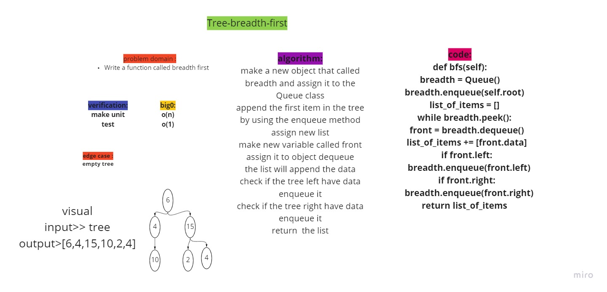

# Tree-max
<!-- Short summary or background information -->
- Find the Maximum Value in a Binary Tree.

## Challenge
<!-- Description of the challenge -->

    Write a function called breadth first
    Arguments: tree
    Return: list of all values in the tree, in the order they were encountered

## Approach & Efficiency
<!-- What approach did you take? Why? What is the Big O space/time for this approach? -->

<!-- Description of each method publicly available in each of your trees -->
- time: O(1)
-space:0(n)

## Unit test

- [x] Can successfully retun the tree in breadth-first order
- [x] return None if the tree is empty

## Solution
<!-- Show how to run your code, and examples of it in action -->
[Pull Request](https://github.com/mohammadsilwadi/data-structures-and-algorithms/pull/32)
 ## Whiteboard Process
<!-- Embedded whiteboard image -->
+ [ Whiteboard   ](https://miro.com/app/board/o9J_lmxyEIQ=/)

