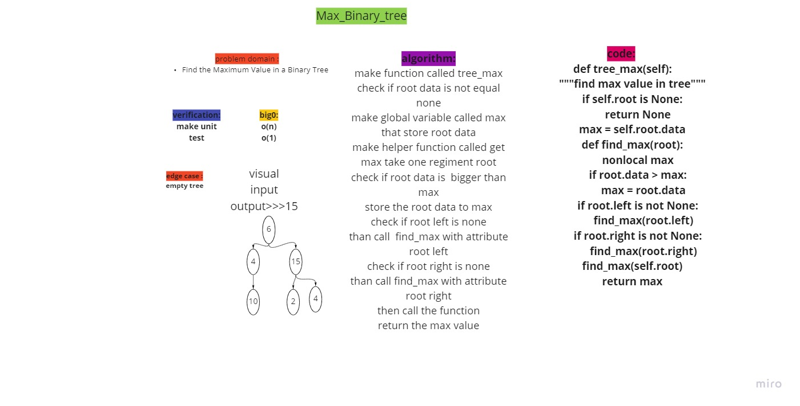

# Tree-max
<!-- Short summary or background information -->
- Find the Maximum Value in a Binary Tree.

## Challenge
<!-- Description of the challenge -->
Write the following method for the Binary Tree class

    find maximum value
        Arguments: none
        Returns: number

Find the maximum value stored in the tree. You can assume that the values stored in the Binary Tree will be numeric.

## Approach & Efficiency
<!-- What approach did you take? Why? What is the Big O space/time for this approach? -->
- Add
  - Arguments: value
  - Return: nothing
  - Adds a new node with that value in the correct location in the binary search tree.
- Contains
  - Argument: value
  - Returns: boolean indicating whether or not the value is in the tree at least once.

## API
<!-- Description of each method publicly available in each of your trees -->
- time: O(1)
-space:0(n)

## Unit test

- [x] Can successfully get max value
- [x] return None if the tree is empty'

## Solution
<!-- Show how to run your code, and examples of it in action -->
[Pull Request](https://github.com/mohammadsilwadi/data-structures-and-algorithms/pull/31)
 ## Whiteboard Process
<!-- Embedded whiteboard image -->
+ [ Whiteboard   ](https://miro.com/app/board/o9J_lmxyEIQ=/)

