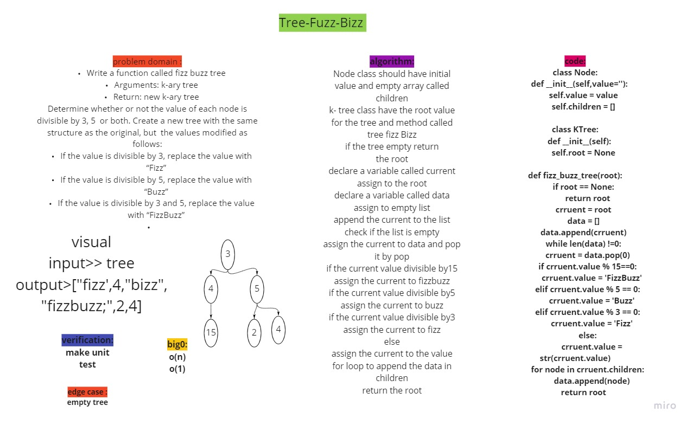

# Tree-fizz-buzz
<!-- Short summary or background information -->
- Find the Maximum Value in a Binary Tree.

## Challenge
<!-- Description of the challenge -->

    Write a function called fizz buzz tree
    Arguments: k-ary tree
    Return: new k-ary tree
If the value is divisible by 3, replace the value with “Fizz”
If the value is divisible by 5, replace the value with “Buzz”
If the value is divisible by 3 and 5, replace the value with “FizzBuzz”

## Approach & Efficiency
<!-- What approach did you take? Why? What is the Big O space/time for this approach? -->

<!-- Description of each method publicly available in each of your trees -->
- time: O(1)
-space:0(n)

## Unit test

- [x] If the value is divisible by 3, replace the value with “Fizz”
- [x] If the value is divisible by 5, replace the value with “Buzz”
- [x] If the value is divisible by 3 and 5, replace the value with “FizzBuzz”
- [x] If the value is not divisible by 3 or 5, simply turn the number into a String.

## Solution
<!-- Show how to run your code, and examples of it in action -->
[Pull Request](https://github.com/mohammadsilwadi/data-structures-and-algorithms/pull/33)
 ## Whiteboard Process
<!-- Embedded whiteboard image -->
+ [ Whiteboard   ](https://miro.com/app/board/o9J_lmxyEIQ=/)

